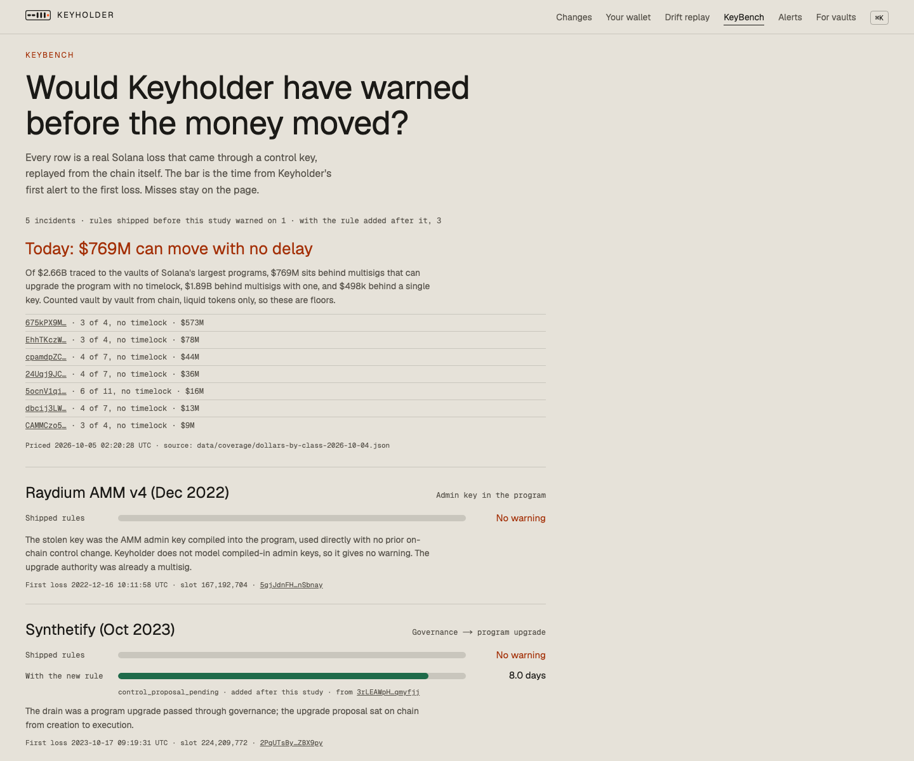

# Keyholder

**$769M on Solana can be moved today by multisigs that need no waiting period.** Keyholder reads who controls every program, rings when that control weakens, and lets a vault refuse deposits into a protocol whose control just changed.

[](https://keyholder-ashy.vercel.app/keybench)

**Live:** [keyholder-ashy.vercel.app](https://keyholder-ashy.vercel.app) · [KeyBench](https://keyholder-ashy.vercel.app/keybench) · [Drift replay](https://keyholder-ashy.vercel.app/replay/drift) · [For vaults](https://keyholder-ashy.vercel.app/policy)

## What it does

- **Control graph.** For 557 OtterSec-verified programs: upgrade authority → multisig → each signer key, and for the 18 money-layer programs with an IDL, the admin keys stored inside program config.
- **Alerts.** A worker decodes every control-relevant transaction (loader upgrades and authority changes, Squads v3/v4 and coral multisig changes, durable nonces, spl-governance proposals) and runs it through a versioned rule engine (`packages/risk`).
- **The check.** An Anchor program (devnet) that a vault calls before it moves money: it refuses when the target's control is below the vault's policy or changed recently.
- **Dollar coverage.** $2.66B traced vault by vault to the program that controls it: $1.89B behind multisigs with a timelock, $769M behind multisigs with none, $0.5M behind a single key (floors: liquid tokens only).
- **A provable log.** Every day the control state of all covered programs is written to `program_daily`, hashed, and the hash is posted on chain as a memo. `verify-anchor` recomputes it from the rows; changing any row breaks it.

## KeyBench

Real Solana losses that came through a control key, replayed from the transactions themselves and scored by the same engine the live service runs.

| incident | rules that existed before KeyBench | with the rule added after it |
|---|---|---|
| Drift (Apr 2026, $285M) | 5.6 days before the first drain | 5.6 days |
| Synthetify (Oct 2023) | no warning | 8.0 days |
| BonkDAO BIP #76 (Jul 2026) | no warning | 6.0 days |
| Raydium AMM v4 (Dec 2022) | no warning | no warning |
| Rain card contract (Aug 2026) | no warning | no warning |

The second column comes from `control_proposal_pending`, written after studying these incidents; it is labelled as fitted to them and is not counted as proof until it warns on one it has not seen. Method, corrections to press accounts and open gaps: [`design/keybench/KEYBENCH.md`](design/keybench/KEYBENCH.md).

## Run it

```bash
pnpm install
source scripts/env.sh                      # toolchain: solana 4.3, anchor 1.2
pnpm -r typecheck && pnpm test             # worker, decoder, risk, program tests
cd apps/worker && npx tsx src/keybench/score.ts            # rescore KeyBench from data/keybench
cd apps/worker && npx tsx src/coverage/verify-anchor.ts YYYY-MM-DD   # check a day's anchor
```

Layout: `apps/web` (Next.js site), `apps/worker` (ingest, decode, state, risk, alerts, daily log), `packages/decoder` (byte-level parsers verified on real mainnet accounts), `packages/risk` (rules), `programs/keyholder` (the on-chain check), `scripts/keybench` (chain-read incident and dollar scripts), `evidence/` (dated findings with signatures).

## Honest limits

- KeyBench has 5 incidents; the shipped rules warned on 1. Compiled-in admin keys (Raydium, Pump.fun) are not modelled.
- Dollar figures are floors for the 33 largest programs; most are named by program id, ownership proven on chain only for Raydium and Kamino.
- The daily log starts 2026-10-02; anchors are on devnet.
